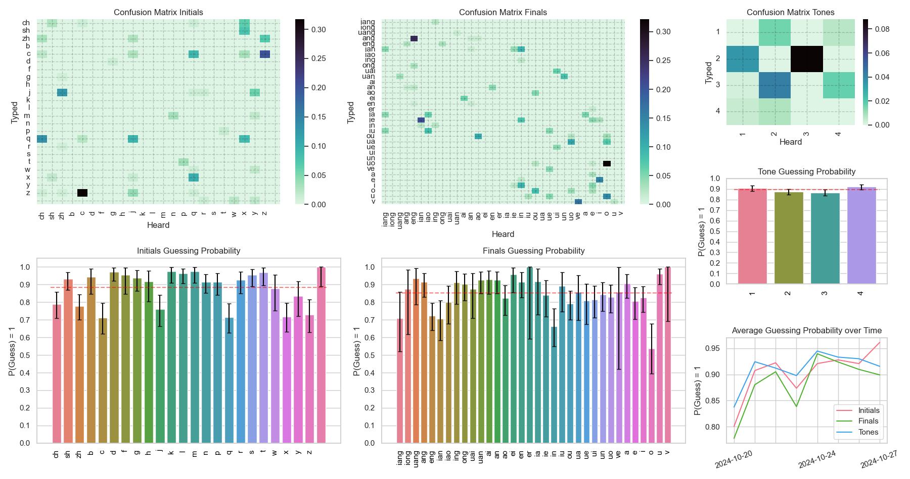
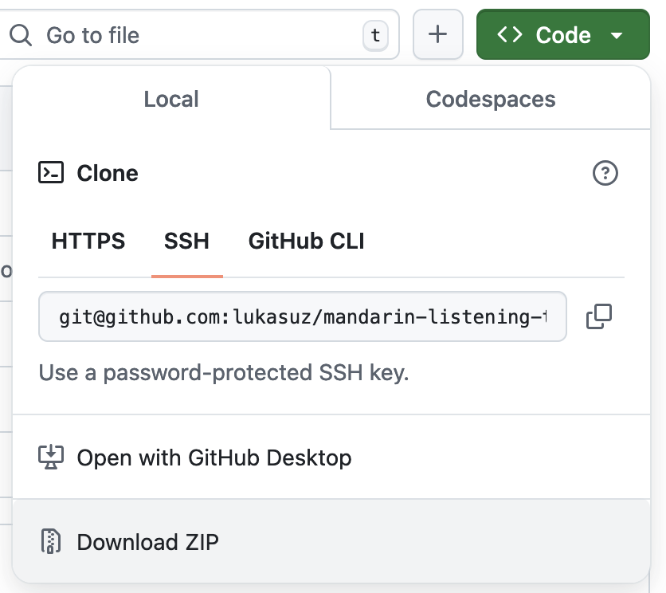

## What Is This?
This is a small application that helps practice your Mandarin listening comprehension by transcribing audio to pinyin. It locally tracks all of the errors you make during transcription and will more frequently present the syllables you struggled with. For example, if you struggle with the initial 'zh' over time, the app will play you more syllables containing this initial, e.g. 'zhu', 'zhang', 'zhou' etc. This sampling logic is not only applied to initials but also to finals *(e.g. 'ang', 'en', etc.)* and tones *(1,2,3,4)*. See the example below on how the app works.


Next to the smart sampling of syllables, your historical data can be displayed in a dashboard, highlighting your errors concerning three categories: Initials, finals, and tones. An example of the dashboard is shown below. 

For each category, you can see the average guessing probability for each expression of the category as well as the confusion matrix. For example, in the guessing probability plot, you can see that the initial 'ch' was guessed correctly about 80% of the time, while the final 'o' was only guessed correctly 50% of the time. The red horizontal line shows the average for the whole category. The confusion matrix can give you more precise information. For example, 30% of the time 'c' as an initial was played, and a 'z' was typed instead. This corresponds to confusing 'cai' with 'zai'. Note that the x-axis shows what you have heard, while the y-axis shows what was typed by the user. Lastly, the plot on the bottom right displays your performance over time.




*There might be bugs, if you encounter one please open an issue or, better, open a pull request* 🙂.

## Installation

### Option 1: You know how to use git and Python
```git clone https://github.com/lukasuz/mandarin-listening-trainer```

```cd mandarin-listening-trainer```

```pip install -e ./```

Alternatively, you can run the ```train.py``` or ```stats.py``` directly after installing the dependencies. For dependencies, check the setup.py.

### Option 2: You do not know how to use git and Python

You will need Python to run this app. If you are on MacOS or Linux, it should be installed by default. If you are a  Windows user (or it is not preinstalled), you can download Python [here](https://www.python.org/). When installing Python manually on Windows, tick the checkbox that you want to add Python to PATH during installation.

After installation, click the green 'Code' button to download the repository and unzip it, e.g. on your Desktop.


Then, open your terminal or command prompt, and navigate to this folder. If you do not know how to do this check here for [Windows](https://www.wikihow.com/Change-Directories-in-Command-Prompt), [Linux](https://ubuntu.com/tutorials/command-line-for-beginners#3-opening-a-terminal), or [MacOs](https://www.macworld.com/article/221277/command-line-navigating-files-folders-mac-terminal.html). Once in the folder, install the application by typing the following command into the terminal: ```pip install -e ./```. Now you will be able to start the app from anywhere by using the terminal. Check the next section for how to do so.


## Usage
After installation, you can run the following two commands to either start the training or plot your training dashboard.

**Start the training**: ```mltrain```

**Show your training dashboard**: ```mlplot```

### Basic Interaction:
When the app starts, it will play a syllable to you. You will have to type in what you heard, e.g. ```hao3```, and confirm by pressing *enter* (3 is the tone here). If your answer is correct, the next example will be played, if your answer is incorrect, the file will be replayed. All interactions will be locally stored in a .csv file.

**Play the sound again:** Just press *enter* without typing anything. Note that this will recorded as an error.

**Exit:** To exit the application type ```exit``` and confirm with *enter*.

**Give Up:** If you can figure out the syllable, type ```give up``` and confirm with *enter*. This will show you the answer, and the next sample will be played.

**Break:** If you want to replay the sound without recording it as an error, e.g. when you had a break, you can type ```break``` and confirm with *enter*.

## Licenses
Note that the code is under the GPL-3 License. If you use this code base in your project, you must acknowledge this repository. For more details check the license file.

You may not access the tone API from other sources than this application. The sound files are kindly provided by [tone-perfect](https://tone.lib.msu.edu/). Please note that if API access is abused, I will have to stop the server.
